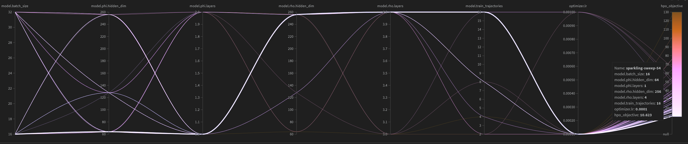
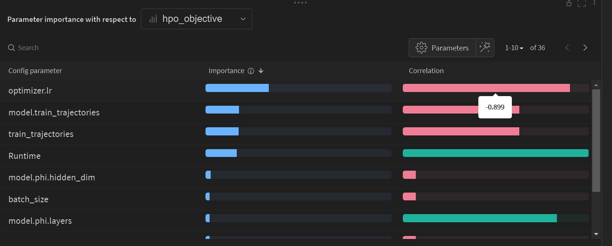

# Symmetry and Dynamic Programming
Source for "Exploiting Symmetry in High-Dimensional Dynamic Programming"

**Warning**: See the [HyperParameter Tuning section](#hyperparameter-tuning) for more details on robustness checks, tuning, and examples using [Weights and Biases](wandb.ai).  Hyperparameter optimization is an essential part of the machine learning workflow, and it rarely not make sense to check for robustness without considering how/when a new HPO process is required.

Since manual tweaking of hyperparameters is slow and error prone, a variety of ML tools to automate the process and visualization.  The primary [investment_euler.py](investment_euler.py) and related code is provided as an expanding of this tooling.

## Installing

### Quick Installation Instructions
Within a python environment, clone this repository with git and execute `pip install -r requirements.txt`.

See more complete instructions below in the [detailed installation](#detailed-installation-instructions) section.

## Jupyter Notebook for Exploration

You can load the Jupyter notebook [baseline_example.ipynb](baseline_example.ipynb) directly in VS Code or on the command-line with `jupyter lab` run in the local directory.  This notebook loads the `investment_euler.py` and provides utilities to examine the output without using it on the commandline.

## CLI Usage
There is a command-line interface to solve for the equilibrium given various model and neural network parameters.  This is especially convenient for deploying on the cloud or when running in parallel.

The default values of all parameters is given by [investment_euler_default.yaml](investment_euler_default.yaml). You can override these by passing in a different YAML file, or by passing in the parameters on the commandline.

To use this, in a console at the root of this project, you can do things such as the following.
```bash
python investment_euler.py --trainer.max_epochs=5
```
Or to change the neural network architecture, you could try things such as increasing the `L` of the model
```bash
python investment_euler.py --trainer.max_epochs=2 --model.rho.n_in=8 --model.phi.n_out=8 
```
Or changing the number of layers
```bash
python investment_euler.py --trainer.max_epochs=5 --model.phi.layers=1
```

To change the economic variables such nonlinearity in prices, you could try things such as

```bash
python investment_euler.py --trainer.max_epochs=5 --model.nu=1.1
```

Note that for the `nu != 1` there is no closed form to check against.

# Hyperparameter Tuning

Central to deep learning is the need to tuning hyperparameters.  It rarely makes sense to check for robustness of a solution to changes in the neural network structure and hyperparameters.


## Weights and Biases
One tool for managing parameters and hyperparameter optimization is [Weights and Biases](https://wandb.ai/).  This is a free service for academic use.  It provides a dashboard to track experiments, and a way to run hyperparameter optimization sweeps.


To use, first create an account with [Weights and Biases](https://wandb.ai/) then, assuming you have installed the packages above, ensure you have logged in,
```bash
wandb login
```

The [train_time_sweep.yaml](train_time_sweep.yaml) file contains a list of parameters defining the sweeep of interest.  See [W&B docs](https://docs.wandb.ai/guides/sweeps/define-sweep-configuration) for more details, including how to handle distributions.
  probv
For our example sweep, in a terminal run
```bash
wandb sweep train_time_sweep.yaml
```
This will create a new sweep on the server.  It will give you a URL to the sweep, which you can open in a browser.  You can also see the sweep in your [W&B dashboard](https://wandb.ai/home).  You will need the returned ID as well.

This doesn't create any "agents".  To do that, take the `<sweep_id>` that was returned and run
```bash
wandb agent <sweep_id>
```
Or to only execute a fixed number of experiments on that agent, give it a count (e.g. `wandb agent --count 10 <sweep_id>`).

You can then login to the server and run that same line, with the provided sweep_id, to execute the same experiments on a different machine.
## Example Results
See [W&B Training Time Sweep Results](https://wandb.ai/highdimensionaleconlab/symmetry_dp_examples/sweeps/ie7xdfv8?workspace=user-) for an example.  A few useful features of this tool include,



This provides a standard visualization to evaluate many different hyperparameters, listed along the top and each with its own y-axis.  The color matches the objective of the HPO sweep, where the value is shown on the rightmost side.




Another visualization is to look at the correlation between the hyperparameter and the objective, as shown above, which summarizes the relative importance.


# Detailed Installation Instructions
For users with less experience using python, conda, and VS Code, the following provides more details.

1. Ensure you have installed Python.  For example, using [Anaconda](https://www.anaconda.com/products/individual)
2. Recommended but not required: Install [VS Code](https://code.visualstudio.com/) along with its [Python Extension](https://code.visualstudio.com/docs/languages/python)
3. Clone this repository
   - Recommended: With VS Code, go `<Shift-Control-P>` to open up the commandbar, then choose `Git Clone`, and use the URL `https://github.com/HighDimensionalEconLab/symmetry_dynamic_programming.git`.  That will give you a full environment to work with.
   - Alternatively, you can clone it with git installed `git clone https://github.com/HighDimensionalEconLab/symmetry_dynamic_programming.git`
4. (Optional) create a conda [virtual environment](https://docs.conda.io/projects/conda/en/latest/user-guide/tasks/manage-environments.html)
    ```bash
    conda create -n symmetry_dp python=3.9
    conda activate symmetry_dp
    ```
    - In VS Code, you can then do `<Shift-Control-P>` to open up the commandbar, then choose `> Python: Select Interpreter`, and choose the one in the `symmetry_dp` environment.  Future `> Python: Terminal` commands then automatically activate it.
5. Install dependencies.  With a terminal in that cloned folder (after, optionally, activating an environment as discussed above).
    ```bash
    pip install -r requirements.txt
    ```
    - If you are in VS Code, opening a python terminal with  `<Shift-Control-P>` then  `> Python: Terminal` will automatically activate the environment and start in the correct location.

**Troubleshooting:** If pytorch is not working, consider [installing manually](https://pytorch.org/get-started/locally/#start-locally) with `conda install pytorch cpuonly -c pytorch ` or something similar, and then retrying the dependencies installation.  GPUs are not required for these experiments.   If you get compatibility clashes between packages with the `pip install -r requirements.txt` then we recommend using a virtual environment with conda, as described above.
